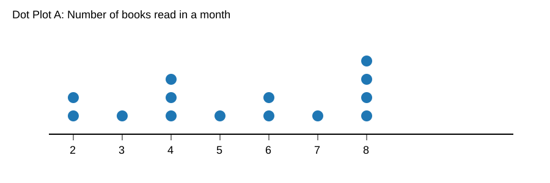
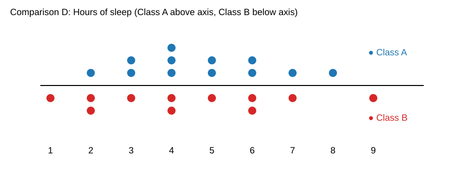

# Singapore Math Dimensions 6B — Unit 13 Pretest
## Unit 13: Displaying and Comparing Data

**Student Name:** ____________________  
**Date:** ____________________  

### Directions
- Show your work for computation questions.
- For graph interpretation questions, use the provided images.
- Round to the nearest tenth when needed.

---

## Part A: Statistical Variability, Statistical Questions, and Measures of Center

1. **Statistical question or not?**  
   Is this a statistical question: *"How many siblings do students in our class have?"* Explain why or why not.

2. **Statistical question or not?**  
   Is this a statistical question: *"What is 7 × 8?"* Explain why or why not.

3. Find the **mean** of this data set:  
   `8, 10, 10, 11, 13, 14`

4. Find the **median** of this data set:  
   `4, 6, 9, 10, 10, 15, 18`

5. Find the **mode** of this data set:  
   `3, 5, 5, 6, 8, 8, 8, 10`

6. The test scores are: `70, 72, 73, 73, 75, 98`.  
   Which measure of center (**mean or median**) better represents the typical score? Explain.

---

## Part B: Displaying Numerical Data (Dot Plots and Histograms)

Use **Dot Plot A** (`education/images/dot_plot_a.svg`) for Questions 7–10.

7. How many data values are shown in Dot Plot A?

8. What is the **mode** of Dot Plot A?

9. What is the **median** value in Dot Plot A?

10. Describe one thing Dot Plot A shows about the distribution (for example: cluster, gap, or spread).

Use **Histogram B** (`education/images/histogram_b.svg`) for Questions 11–14.

11. Which score interval has the greatest frequency?

12. How many students scored in the range **80–99** combined?

13. Estimate how many total students are represented in Histogram B.

14. Based on Histogram B, is the distribution closer to symmetric, skewed left, or skewed right? Briefly explain.

---

## Part C: Measures of Variability and Box Plots

15. Find the **range** of: `9, 12, 14, 18, 21, 21, 23`

16. Find the **mean absolute deviation (MAD)** of the data set: `2, 4, 6, 8, 10`

17. Find the **interquartile range (IQR)** of: `5, 6, 8, 9, 10, 12, 14, 15, 17`

Use **Box Plot C** (`education/images/box_plot_c.svg`) for Questions 18–19.

18. What is the **five-number summary** (minimum, Q1, median, Q3, maximum) shown in Box Plot C?

19. What is the **IQR** represented by Box Plot C?

Use **Comparison D** (`education/images/comparison_d.svg`) for Question 20.

20. Compare the two classes in Comparison D. Which class appears to have the **greater variability** in hours of sleep, and how can you tell from the dot plots?

---

## Optional Teacher Key (remove before student distribution if desired)
1. Yes; it expects different answers from different students.
2. No; it has one fixed answer.
3. Mean = 11.0
4. Median = 10
5. Mode = 8
6. Median (73) is better; 98 is a high outlier.
7. 14 values
8. 8
9. 5.5
10. Example: values cluster around 4–8.
11. 60–69
12. 6 students
13. 26 students
14. Roughly symmetric to slightly right-skewed (acceptable with reasoning).
15. 14
16. MAD = 2.4
17. IQR = 7
18. 12, 15, 20, 27, 33
19. 12
20. Class B (or justified comparison) because values are spread from 1 to 9, while Class A is more concentrated.

---

### Google Docs Export Notes
To use this as a Google Doc:
1. Upload `dimensions_math_6b_unit13_pretest.md` to Google Drive.
2. Open with Google Docs.
3. If images do not embed automatically, insert the 4 SVGs from `education/images/` manually.
